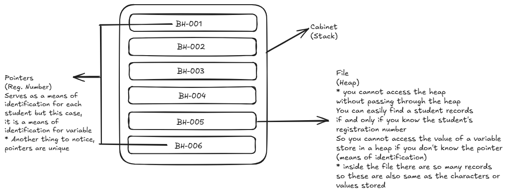

# Computer Architecture: Stack and Heap Explained

This is a simplified explanation of computer architecture, focusing on the **stack** and **heap** sections of memory.

---

## **Computer Architecture Basics**
Computer architecture is like the blueprint of how a computer works. It includes the CPU (brain), memory (where data is stored), and other components that work together to run programs.

Memory is divided into different sections, and two of the most important ones are the **stack** and the **heap**. These are used to store data while a program is running.

---

## **The Stack**
- **What it is**: The stack is a section of memory that works like a stack of plates: **Last In, First Out (LIFO)**. This means the last thing you put on the stack is the first thing you take off.
- **How it works**:
  - When a function is called, its data (like local variables) is "pushed" onto the stack.
  - When the function finishes, its data is "popped" off the stack.
- **Why it's fast**: The stack is very organized and predictable, so the CPU can access it quickly.
- **What it stores**:
  - Local variables (e.g., `int x = 10;`).
  - Function calls and their return addresses.
- **Limitations**:
  - The stack has a fixed size, so if you try to store too much data (e.g., with deep recursion), you get a **stack overflow** error.

---

## **The Heap**
- **What it is**: The heap is a section of memory used for **dynamic memory allocation**. Unlike the stack, it doesn't follow a strict order, and you can allocate and free memory whenever you need.
- **How it works**:
  - When you need memory (e.g., for an array or object), you request it from the heap using functions like `malloc()` in C or `new` in C++/Java.
  - You must manually free this memory when you're done (in some languages, like C/C++), or it will lead to **memory leaks**.
- **Why it's flexible**: The heap can grow and shrink as needed, and you can allocate large amounts of memory.
- **What it stores**:
  - Dynamically created objects (e.g., `int* arr = new int[100];`).
  - Data that needs to persist beyond the scope of a function.
- **Limitations**:
  - The heap is slower than the stack because it’s less organized.
  - Managing memory manually can lead to errors like memory leaks or dangling pointers.

---

## **Stack vs. Heap: Key Differences**
| **Feature**       | **Stack**                          | **Heap**                          |
|--------------------|------------------------------------|-----------------------------------|
| **Speed**          | Fast                              | Slower                           |
| **Memory Management** | Automatic (handled by the system) | Manual (programmer must manage)  |
| **Size**           | Fixed size                        | Flexible size                    |
| **Lifetime**       | Short (tied to function scope)    | Long (persists until freed)      |
| **Use Case**       | Local variables, function calls   | Dynamic data, large objects      |

---

## **Example in Code**
```c
#include <stdlib.h>

void function() {
    int x = 10;
    int* y = (int*)malloc(sizeof(int)); 
    *y = 20;
    free(y);
}
```

